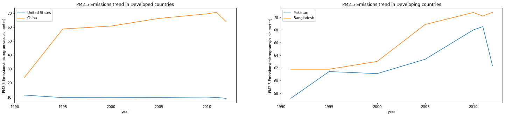
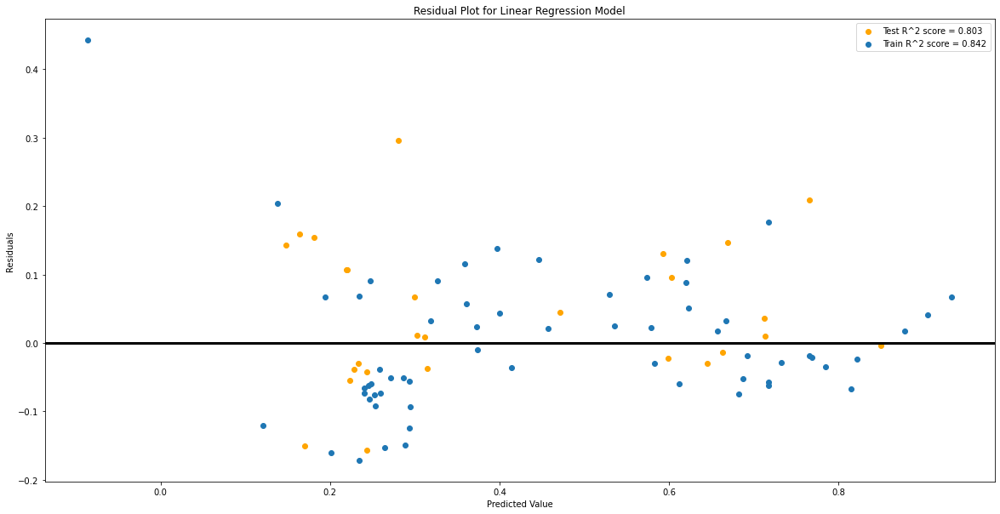

# **Analysis of the Impact of Environmental Variables on the Death Rate in Developing and Developed Countries**


## Group Members
1. Sara Mahmood
2. Fasih Hussain
3. Rabeea Atif Rana

## Countries

### Developed Countries
- China
- US

### Developing Countries
- Pakistan
- Bangladesh


## Variables Analysed

1. Death rate and CO2 emissions
2. Death rate and Water Quality
3. Death rate and PM2.5
4. Death rate and Sanitation
5. Death rate and health expenditure


```python
import pandas as  pd
import numpy as np
import matplotlib.pyplot as plt
import seaborn as sns
```


## Column Names:
Year<br>
CountryName<br>
CO2 emissions (metric tons per capita): CO2Emissions<br>
Health expenditure, total (% of GDP): HealthExpenditure<br>
Death rate, crude (per 1,000 people): DeathRate<br>
Life expectancy at birth, total (years): LifeExpectancy<br>
Improved water source (% of population with access): ImprovedWaterSources<br>
Improved sanitation facilities (% of population with access): ImprovedSanitationFacilities<br>
PM2.5 air pollution, mean annual exposure (micrograms per cubic meter): PM2.5AirPollution

# Data Loading


```python
# Loading data from csv
data = pd.read_csv('data.csv')
data = data.drop(columns=['CCode', 'ICode'])

data.head(5)
```


<div>
<style scoped>
    .dataframe tbody tr th:only-of-type {
        vertical-align: middle;
    }

    .dataframe tbody tr th {
        vertical-align: top;
    }

    .dataframe thead th {
        text-align: right;
    }
</style>
<table border="1" class="dataframe">
  <thead>
    <tr style="text-align: right;">
      <th></th>
      <th>CName</th>
      <th>IName</th>
      <th>1991</th>
      <th>1992</th>
      <th>1993</th>
      <th>1994</th>
      <th>1995</th>
      <th>1996</th>
      <th>1997</th>
      <th>1998</th>
      <th>...</th>
      <th>2003</th>
      <th>2004</th>
      <th>2005</th>
      <th>2006</th>
      <th>2007</th>
      <th>2008</th>
      <th>2009</th>
      <th>2010</th>
      <th>2011</th>
      <th>2012</th>
    </tr>
  </thead>
  <tbody>
    <tr>
      <th>0</th>
      <td>Bangladesh</td>
      <td>Net ODA received (% of GNI)</td>
      <td>5.946642263</td>
      <td>5.67298284</td>
      <td>4.199778687</td>
      <td>4.99230555</td>
      <td>3.278379</td>
      <td>2.932553053</td>
      <td>2.317258122</td>
      <td>2.554453116</td>
      <td>...</td>
      <td>2.546453403</td>
      <td>2.374527125</td>
      <td>2.081673</td>
      <td>1.851611969</td>
      <td>2.060906671</td>
      <td>2.390829337</td>
      <td>1.257445485</td>
      <td>1.289898</td>
      <td>1.220708</td>
      <td>1.685637</td>
    </tr>
    <tr>
      <th>1</th>
      <td>Brazil</td>
      <td>Net ODA received (% of GNI)</td>
      <td>0.040571613</td>
      <td>-0.067273152</td>
      <td>0.046729733</td>
      <td>0.046794033</td>
      <td>0.035798</td>
      <td>0.0326374</td>
      <td>0.030392072</td>
      <td>0.034186768</td>
      <td>...</td>
      <td>0.03709298</td>
      <td>0.023980719</td>
      <td>0.028367</td>
      <td>0.010680851</td>
      <td>0.023993362</td>
      <td>0.028515885</td>
      <td>0.02121569</td>
      <td>0.021541</td>
      <td>0.033560</td>
      <td>0.058095</td>
    </tr>
    <tr>
      <th>2</th>
      <td>China</td>
      <td>Net ODA received (% of GNI)</td>
      <td>0.508160929</td>
      <td>0.707864694</td>
      <td>0.730135841</td>
      <td>0.562284855</td>
      <td>0.484573</td>
      <td>0.31293156</td>
      <td>0.217426097</td>
      <td>0.243172522</td>
      <td>...</td>
      <td>0.083187377</td>
      <td>0.089059884</td>
      <td>0.080967</td>
      <td>0.046084147</td>
      <td>0.042487075</td>
      <td>0.032513793</td>
      <td>0.022667722</td>
      <td>0.010942</td>
      <td>-0.009692</td>
      <td>-0.002372</td>
    </tr>
    <tr>
      <th>3</th>
      <td>Ethiopia</td>
      <td>Net ODA received (% of GNI)</td>
      <td>8.216968569</td>
      <td>11.23264698</td>
      <td>12.46920634</td>
      <td>15.64341134</td>
      <td>11.616290</td>
      <td>9.669071467</td>
      <td>6.576755438</td>
      <td>8.248928088</td>
      <td>...</td>
      <td>19.34624774</td>
      <td>18.48597177</td>
      <td>15.868739</td>
      <td>13.57944167</td>
      <td>13.46124136</td>
      <td>12.9886168</td>
      <td>13.56258619</td>
      <td>13.447558</td>
      <td>11.845161</td>
      <td>7.856446</td>
    </tr>
    <tr>
      <th>4</th>
      <td>France</td>
      <td>Net ODA received (% of GNI)</td>
      <td>NaN</td>
      <td>NaN</td>
      <td>NaN</td>
      <td>NaN</td>
      <td>NaN</td>
      <td>NaN</td>
      <td>NaN</td>
      <td>NaN</td>
      <td>...</td>
      <td>NaN</td>
      <td>NaN</td>
      <td>NaN</td>
      <td>NaN</td>
      <td>NaN</td>
      <td>NaN</td>
      <td>NaN</td>
      <td>NaN</td>
      <td>NaN</td>
      <td>NaN</td>
    </tr>
  </tbody>
</table>
<p>5 rows × 24 columns</p>
</div>


# Data Cleaning

**Changing Shape of the Data**


```python
# Changing data shape
data = data.loc[data['IName'].isin(['CO2 emissions (metric tons per capita)', 'Health expenditure, total (% of GDP)', 'Death rate, crude (per 1,000 people)', 'Improved water source (% of population with access)', 'Improved sanitation facilities (% of population with access)', 'PM2.5 air pollution, mean annual exposure (micrograms per cubic meter)'])]

transform = []

for country in data['CName'].unique():
    values = np.array(data[(data['CName']==country)]).T[2:]
    arr = np.zeros((len(values), len(values[0])+2), dtype='object')
    arr[:, 2:] = values
    arr[:, 0] = country
    arr[:, 1] = range(1991, 2013)
    transform.append(arr)

transform = np.concatenate(transform)

data = pd.DataFrame(transform, columns = ['CountryName', 'Year', 'CO2Emissions', 'HealthExpenditure', 'DeathRate', 'ImprovedWaterSources', 'ImprovedSanitationFacilities', 'PM2.5AirPollution'])

data.head(5)
```


<div>
<style scoped>
    .dataframe tbody tr th:only-of-type {
        vertical-align: middle;
    }

    .dataframe tbody tr th {
        vertical-align: top;
    }

    .dataframe thead th {
        text-align: right;
    }
</style>
<table border="1" class="dataframe">
  <thead>
    <tr style="text-align: right;">
      <th></th>
      <th>CountryName</th>
      <th>Year</th>
      <th>CO2Emissions</th>
      <th>HealthExpenditure</th>
      <th>DeathRate</th>
      <th>ImprovedWaterSources</th>
      <th>ImprovedSanitationFacilities</th>
      <th>PM2.5AirPollution</th>
    </tr>
  </thead>
  <tbody>
    <tr>
      <th>0</th>
      <td>Bangladesh</td>
      <td>1991</td>
      <td>0.144999395</td>
      <td>NaN</td>
      <td>9.728</td>
      <td>NaN</td>
      <td>NaN</td>
      <td>..</td>
    </tr>
    <tr>
      <th>1</th>
      <td>Bangladesh</td>
      <td>1992</td>
      <td>0.157859354</td>
      <td>NaN</td>
      <td>9.401</td>
      <td>NaN</td>
      <td>NaN</td>
      <td>..</td>
    </tr>
    <tr>
      <th>2</th>
      <td>Bangladesh</td>
      <td>1993</td>
      <td>0.151502361</td>
      <td>NaN</td>
      <td>9.083</td>
      <td>NaN</td>
      <td>NaN</td>
      <td>..</td>
    </tr>
    <tr>
      <th>3</th>
      <td>Bangladesh</td>
      <td>1994</td>
      <td>0.161621139</td>
      <td>NaN</td>
      <td>8.775</td>
      <td>NaN</td>
      <td>NaN</td>
      <td>..</td>
    </tr>
    <tr>
      <th>4</th>
      <td>Bangladesh</td>
      <td>1995</td>
      <td>0.190341</td>
      <td>3.52965</td>
      <td>8.479</td>
      <td>72.0629</td>
      <td>39.039</td>
      <td>61.8031</td>
    </tr>
  </tbody>
</table>
</div>


**Dropping irrelevant columns from the dataset**


```python
data.shape
```


    (440, 8)


**Data cleaning and removing anomolies (We have "..." in several places in the dataset. This is being replaced with NaN)**


```python
# Removing .. from the data
data = data.replace(['..'], np.NaN)
```

**Exploring and converting data types**


```python
# Setting data type to numeric
for col in data.columns:
    if col != 'CountryName':
        data[col] = pd.to_numeric(data[col])

data.dtypes
```


    CountryName                      object
    Year                              int64
    CO2Emissions                    float64
    HealthExpenditure               float64
    DeathRate                       float64
    ImprovedWaterSources            float64
    ImprovedSanitationFacilities    float64
    PM2.5AirPollution               float64
    dtype: object


**Discovering and handling the missing values**


```python
# Checking for missing values
data.isnull().sum()
```


    CountryName                       0
    Year                              0
    CO2Emissions                     44
    HealthExpenditure                99
    DeathRate                         0
    ImprovedWaterSources            341
    ImprovedSanitationFacilities    341
    PM2.5AirPollution               320
    dtype: int64


```python
# Handling missing values in data
def interpolate(data):
    if data.notnull().sum() > 1:
        return data.interpolate(method='linear').ffill().bfill()
    else:
        return data.ffill().bfill()

data = data.transform(interpolate)

data.head(5)
```


<div>
<style scoped>
    .dataframe tbody tr th:only-of-type {
        vertical-align: middle;
    }

    .dataframe tbody tr th {
        vertical-align: top;
    }

    .dataframe thead th {
        text-align: right;
    }
</style>
<table border="1" class="dataframe">
  <thead>
    <tr style="text-align: right;">
      <th></th>
      <th>CountryName</th>
      <th>Year</th>
      <th>CO2Emissions</th>
      <th>HealthExpenditure</th>
      <th>DeathRate</th>
      <th>ImprovedWaterSources</th>
      <th>ImprovedSanitationFacilities</th>
      <th>PM2.5AirPollution</th>
    </tr>
  </thead>
  <tbody>
    <tr>
      <th>0</th>
      <td>Bangladesh</td>
      <td>1991</td>
      <td>0.144999</td>
      <td>3.52965</td>
      <td>9.728</td>
      <td>72.062879</td>
      <td>39.039047</td>
      <td>61.803144</td>
    </tr>
    <tr>
      <th>1</th>
      <td>Bangladesh</td>
      <td>1992</td>
      <td>0.157859</td>
      <td>3.52965</td>
      <td>9.401</td>
      <td>72.062879</td>
      <td>39.039047</td>
      <td>61.803144</td>
    </tr>
    <tr>
      <th>2</th>
      <td>Bangladesh</td>
      <td>1993</td>
      <td>0.151502</td>
      <td>3.52965</td>
      <td>9.083</td>
      <td>72.062879</td>
      <td>39.039047</td>
      <td>61.803144</td>
    </tr>
    <tr>
      <th>3</th>
      <td>Bangladesh</td>
      <td>1994</td>
      <td>0.161621</td>
      <td>3.52965</td>
      <td>8.775</td>
      <td>72.062879</td>
      <td>39.039047</td>
      <td>61.803144</td>
    </tr>
    <tr>
      <th>4</th>
      <td>Bangladesh</td>
      <td>1995</td>
      <td>0.190341</td>
      <td>3.52965</td>
      <td>8.479</td>
      <td>72.062879</td>
      <td>39.039047</td>
      <td>61.803144</td>
    </tr>
  </tbody>
</table>
</div>


```python
# Checking for missing values
data.isnull().sum()
```


    CountryName                     0
    Year                            0
    CO2Emissions                    0
    HealthExpenditure               0
    DeathRate                       0
    ImprovedWaterSources            0
    ImprovedSanitationFacilities    0
    PM2.5AirPollution               0
    dtype: int64


**Filtering out Developed and Developing Countries**


```python
data = pd.DataFrame(data[(data['CountryName'] == 'China' ) | (data['CountryName'] == 'Pakistan') | (data['CountryName'] == 'United States')  | (data['CountryName'] == 'Bangladesh') ])
data['Status'] = data.CountryName.apply(lambda x: 'developed' if x in ['China', 'United States'] else 'developing')
data

#seprate dfs for dev and un-dev to be used as per need
developed = pd.DataFrame(data[(data['CountryName'] == 'China' ) | (data['CountryName'] == 'United States')])
developing = pd.DataFrame(data[(data['CountryName'] == 'Bangladesh') | (data['CountryName'] == 'Pakistan')])

data
```


<div>
<style scoped>
    .dataframe tbody tr th:only-of-type {
        vertical-align: middle;
    }

    .dataframe tbody tr th {
        vertical-align: top;
    }

    .dataframe thead th {
        text-align: right;
    }
</style>
<table border="1" class="dataframe">
  <thead>
    <tr style="text-align: right;">
      <th></th>
      <th>CountryName</th>
      <th>Year</th>
      <th>CO2Emissions</th>
      <th>HealthExpenditure</th>
      <th>DeathRate</th>
      <th>ImprovedWaterSources</th>
      <th>ImprovedSanitationFacilities</th>
      <th>PM2.5AirPollution</th>
      <th>Status</th>
    </tr>
  </thead>
  <tbody>
    <tr>
      <th>0</th>
      <td>Bangladesh</td>
      <td>1991</td>
      <td>0.144999</td>
      <td>3.529650</td>
      <td>9.728</td>
      <td>72.062879</td>
      <td>39.039047</td>
      <td>61.803144</td>
      <td>developing</td>
    </tr>
    <tr>
      <th>1</th>
      <td>Bangladesh</td>
      <td>1992</td>
      <td>0.157859</td>
      <td>3.529650</td>
      <td>9.401</td>
      <td>72.062879</td>
      <td>39.039047</td>
      <td>61.803144</td>
      <td>developing</td>
    </tr>
    <tr>
      <th>2</th>
      <td>Bangladesh</td>
      <td>1993</td>
      <td>0.151502</td>
      <td>3.529650</td>
      <td>9.083</td>
      <td>72.062879</td>
      <td>39.039047</td>
      <td>61.803144</td>
      <td>developing</td>
    </tr>
    <tr>
      <th>3</th>
      <td>Bangladesh</td>
      <td>1994</td>
      <td>0.161621</td>
      <td>3.529650</td>
      <td>8.775</td>
      <td>72.062879</td>
      <td>39.039047</td>
      <td>61.803144</td>
      <td>developing</td>
    </tr>
    <tr>
      <th>4</th>
      <td>Bangladesh</td>
      <td>1995</td>
      <td>0.190341</td>
      <td>3.529650</td>
      <td>8.479</td>
      <td>72.062879</td>
      <td>39.039047</td>
      <td>61.803144</td>
      <td>developing</td>
    </tr>
    <tr>
      <th>...</th>
      <td>...</td>
      <td>...</td>
      <td>...</td>
      <td>...</td>
      <td>...</td>
      <td>...</td>
      <td>...</td>
      <td>...</td>
      <td>...</td>
    </tr>
    <tr>
      <th>413</th>
      <td>United States</td>
      <td>2008</td>
      <td>18.602273</td>
      <td>16.536135</td>
      <td>8.200</td>
      <td>99.070230</td>
      <td>99.906582</td>
      <td>9.459112</td>
      <td>developed</td>
    </tr>
    <tr>
      <th>414</th>
      <td>United States</td>
      <td>2009</td>
      <td>17.315297</td>
      <td>17.714795</td>
      <td>8.400</td>
      <td>99.096988</td>
      <td>99.925629</td>
      <td>9.408874</td>
      <td>developed</td>
    </tr>
    <tr>
      <th>415</th>
      <td>United States</td>
      <td>2010</td>
      <td>17.564164</td>
      <td>17.657207</td>
      <td>8.000</td>
      <td>99.123745</td>
      <td>99.944677</td>
      <td>9.358636</td>
      <td>developed</td>
    </tr>
    <tr>
      <th>416</th>
      <td>United States</td>
      <td>2011</td>
      <td>11.809653</td>
      <td>17.682976</td>
      <td>8.066</td>
      <td>99.146215</td>
      <td>99.962643</td>
      <td>9.740641</td>
      <td>developed</td>
    </tr>
    <tr>
      <th>417</th>
      <td>United States</td>
      <td>2012</td>
      <td>6.055143</td>
      <td>17.909058</td>
      <td>8.100</td>
      <td>99.168684</td>
      <td>99.980610</td>
      <td>9.003163</td>
      <td>developed</td>
    </tr>
  </tbody>
</table>
<p>88 rows × 9 columns</p>
</div>


# Understanding the Data - EDA

**Current data types**


```python
data.dtypes
```


    CountryName                      object
    Year                              int64
    CO2Emissions                    float64
    HealthExpenditure               float64
    DeathRate                       float64
    ImprovedWaterSources            float64
    ImprovedSanitationFacilities    float64
    PM2.5AirPollution               float64
    Status                           object
    dtype: object


**Total number of countries under analysis**


```python
data.CountryName.nunique()
```


    4


**Descriptive statistics - Seeing the variation in each variables under consideration**


```python
data.describe()
```


<div>
<style scoped>
    .dataframe tbody tr th:only-of-type {
        vertical-align: middle;
    }

    .dataframe tbody tr th {
        vertical-align: top;
    }

    .dataframe thead th {
        text-align: right;
    }
</style>
<table border="1" class="dataframe">
  <thead>
    <tr style="text-align: right;">
      <th></th>
      <th>Year</th>
      <th>CO2Emissions</th>
      <th>HealthExpenditure</th>
      <th>DeathRate</th>
      <th>ImprovedWaterSources</th>
      <th>ImprovedSanitationFacilities</th>
      <th>PM2.5AirPollution</th>
    </tr>
  </thead>
  <tbody>
    <tr>
      <th>count</th>
      <td>88.000000</td>
      <td>88.000000</td>
      <td>88.000000</td>
      <td>88.000000</td>
      <td>88.000000</td>
      <td>88.000000</td>
      <td>88.000000</td>
    </tr>
    <tr>
      <th>mean</th>
      <td>2001.500000</td>
      <td>5.913207</td>
      <td>6.601287</td>
      <td>7.607648</td>
      <td>86.846509</td>
      <td>59.415630</td>
      <td>49.287337</td>
    </tr>
    <tr>
      <th>std</th>
      <td>6.380646</td>
      <td>7.614305</td>
      <td>4.898639</td>
      <td>1.043737</td>
      <td>9.155374</td>
      <td>24.925301</td>
      <td>23.948777</td>
    </tr>
    <tr>
      <th>min</th>
      <td>1991.000000</td>
      <td>0.144999</td>
      <td>2.733933</td>
      <td>5.736000</td>
      <td>68.594345</td>
      <td>28.665912</td>
      <td>9.003163</td>
    </tr>
    <tr>
      <th>25%</th>
      <td>1996.000000</td>
      <td>0.641334</td>
      <td>3.357682</td>
      <td>6.640000</td>
      <td>78.967925</td>
      <td>40.453970</td>
      <td>20.811516</td>
    </tr>
    <tr>
      <th>50%</th>
      <td>2001.500000</td>
      <td>2.280054</td>
      <td>4.201042</td>
      <td>7.449000</td>
      <td>87.854875</td>
      <td>48.766294</td>
      <td>61.800958</td>
    </tr>
    <tr>
      <th>75%</th>
      <td>2007.000000</td>
      <td>7.389786</td>
      <td>8.684723</td>
      <td>8.500000</td>
      <td>94.233820</td>
      <td>78.845341</td>
      <td>65.264660</td>
    </tr>
    <tr>
      <th>max</th>
      <td>2012.000000</td>
      <td>20.249189</td>
      <td>17.909058</td>
      <td>9.835000</td>
      <td>99.721647</td>
      <td>99.980610</td>
      <td>70.793909</td>
    </tr>
  </tbody>
</table>
</div>


**Are there any null values in the data?**


```python
data.isnull().sum()
```


    CountryName                     0
    Year                            0
    CO2Emissions                    0
    HealthExpenditure               0
    DeathRate                       0
    ImprovedWaterSources            0
    ImprovedSanitationFacilities    0
    PM2.5AirPollution               0
    Status                          0
    dtype: int64


**1. Top 5 instances of CO2 emission over the years**


```python
df = data.groupby(['Year', 'CountryName', 'Status'], as_index=False)['CO2Emissions'].\
    mean().dropna().sort_values('CO2Emissions', ascending=False)
df.head(5)
```


<div>
<style scoped>
    .dataframe tbody tr th:only-of-type {
        vertical-align: middle;
    }

    .dataframe tbody tr th {
        vertical-align: top;
    }

    .dataframe thead th {
        text-align: right;
    }
</style>
<table border="1" class="dataframe">
  <thead>
    <tr style="text-align: right;">
      <th></th>
      <th>Year</th>
      <th>CountryName</th>
      <th>Status</th>
      <th>CO2Emissions</th>
    </tr>
  </thead>
  <tbody>
    <tr>
      <th>39</th>
      <td>2000</td>
      <td>United States</td>
      <td>developed</td>
      <td>20.249189</td>
    </tr>
    <tr>
      <th>27</th>
      <td>1997</td>
      <td>United States</td>
      <td>developed</td>
      <td>19.876405</td>
    </tr>
    <tr>
      <th>35</th>
      <td>1999</td>
      <td>United States</td>
      <td>developed</td>
      <td>19.824009</td>
    </tr>
    <tr>
      <th>31</th>
      <td>1998</td>
      <td>United States</td>
      <td>developed</td>
      <td>19.778914</td>
    </tr>
    <tr>
      <th>55</th>
      <td>2004</td>
      <td>United States</td>
      <td>developed</td>
      <td>19.776845</td>
    </tr>
  </tbody>
</table>
</div>


```python
data.corr()
```


<div>
<style scoped>
    .dataframe tbody tr th:only-of-type {
        vertical-align: middle;
    }

    .dataframe tbody tr th {
        vertical-align: top;
    }

    .dataframe thead th {
        text-align: right;
    }
</style>
<table border="1" class="dataframe">
  <thead>
    <tr style="text-align: right;">
      <th></th>
      <th>Year</th>
      <th>CO2Emissions</th>
      <th>HealthExpenditure</th>
      <th>DeathRate</th>
      <th>ImprovedWaterSources</th>
      <th>ImprovedSanitationFacilities</th>
      <th>PM2.5AirPollution</th>
    </tr>
  </thead>
  <tbody>
    <tr>
      <th>Year</th>
      <td>1.000000</td>
      <td>0.014852</td>
      <td>0.074608</td>
      <td>-0.510645</td>
      <td>0.338409</td>
      <td>0.171531</td>
      <td>0.160003</td>
    </tr>
    <tr>
      <th>CO2Emissions</th>
      <td>0.014852</td>
      <td>1.000000</td>
      <td>0.901867</td>
      <td>0.392661</td>
      <td>0.793316</td>
      <td>0.928052</td>
      <td>-0.909819</td>
    </tr>
    <tr>
      <th>HealthExpenditure</th>
      <td>0.074608</td>
      <td>0.901867</td>
      <td>1.000000</td>
      <td>0.403610</td>
      <td>0.757047</td>
      <td>0.933430</td>
      <td>-0.953642</td>
    </tr>
    <tr>
      <th>DeathRate</th>
      <td>-0.510645</td>
      <td>0.392661</td>
      <td>0.403610</td>
      <td>1.000000</td>
      <td>0.195422</td>
      <td>0.246143</td>
      <td>-0.481457</td>
    </tr>
    <tr>
      <th>ImprovedWaterSources</th>
      <td>0.338409</td>
      <td>0.793316</td>
      <td>0.757047</td>
      <td>0.195422</td>
      <td>1.000000</td>
      <td>0.829073</td>
      <td>-0.730322</td>
    </tr>
    <tr>
      <th>ImprovedSanitationFacilities</th>
      <td>0.171531</td>
      <td>0.928052</td>
      <td>0.933430</td>
      <td>0.246143</td>
      <td>0.829073</td>
      <td>1.000000</td>
      <td>-0.902198</td>
    </tr>
    <tr>
      <th>PM2.5AirPollution</th>
      <td>0.160003</td>
      <td>-0.909819</td>
      <td>-0.953642</td>
      <td>-0.481457</td>
      <td>-0.730322</td>
      <td>-0.902198</td>
      <td>1.000000</td>
    </tr>
  </tbody>
</table>
</div>


```python
ch = data.loc[data['CountryName'] == "China"]
us = data.loc[data['CountryName'] == "United States"]
pk = data.loc[data['CountryName'] == "Pakistan"]
bgd = data.loc[data['CountryName'] == "Bangladesh"]


```

# **GENERAL TREND ANALYSIS OVER THE YEARS OF ALL THE VARIABLES**

## 1. Death Rate Trend Analysis in Developed and Developing Countries


```python
data.rename(columns={'Death rate, crude (per 1,000 people)':'DeathRate'}, inplace=True)
import matplotlib.pyplot as plt
fig,ax = plt.subplots()
 
# DEVELOPED COUNTRIES
for name in ['United States','China']:
    ax.plot(data[data.CountryName==name].Year,data[data.CountryName==name].DeathRate,label=name)
 
ax.set_xlabel("year")
ax.set_ylabel("Death Rate(crude/1000 people)")
ax.set_title('Death rate trend in developed countries')
ax.legend(loc='best')
 
fig,ax1 = plt.subplots()
 
# UNDER-DEVELOPED COUNTRIES
for name in ['Pakistan','Bangladesh']:
    ax1.plot(data[data.CountryName==name].Year,data[data.CountryName==name].DeathRate,label=name)
 
ax1.set_xlabel("year")
ax1.set_ylabel("Death Rate (crude/1000 people)")
ax1.set_title('Death rate trend in developing countries')
ax1.legend(loc='best')
 
# fig,ax2 = plt.subplots()
# ax2 = data.plot.scatter(data[data.CountryName==name].Year,data[data.CountryName==name].DeathRate,label=name)
```


    <matplotlib.legend.Legend at 0x1c49ee24e80>


    

    


    

    


Developed = the resources have been maintained and thus no significant increase or decrease is observed

Developing = work is being done to decrease the death rate

## 2. PM2.5 and CO2 trend Analysis in Developed and Developing Countries


```python
data.rename(columns={'CO2 emissions (metric tons per capita)':'CO2emissions'}, inplace=True)
fig,ax = plt.subplots(nrows=1, ncols=2, figsize=(25, 5))

# DEVELOPED COUNTRIES
for name in ['United States','China']:
    ax[0].plot(data[data.CountryName==name].Year,data[data.CountryName==name].CO2Emissions,label=name)

ax[0].set_xlabel("year")
ax[0].set_ylabel("CO2 Emission(metric ton/capita)")
ax[0].set_title('CO2 Emission trend in Developed countries')
ax[0].legend(loc='best')

# UNDER-DEVELOPED COUNTRIES
for name in ['Pakistan','Bangladesh']:
    ax[1].plot(data[data.CountryName==name].Year,data[data.CountryName==name].CO2Emissions,label=name)

ax[1].set_xlabel("year")
ax[1].set_ylabel("CO2 Emission(metric ton/capita)")
ax[1].set_title('CO2 Emission trend in developing countries')
ax[1].legend(loc='best')

fig,ax = plt.subplots(nrows=1, ncols=2, figsize=(25, 5))
# DEVELOPED COUNTRIES
for name in ['United States','China']:
    ax[0].plot(data[data.CountryName==name].Year,data[data.CountryName==name]["PM2.5AirPollution"],label=name)

ax[0].set_xlabel("year")
ax[0].set_ylabel("PM2.5 Emissions(micrograms/cubic meter)")
ax[0].set_title('PM2.5 Emissions trend in Developed countries')
ax[0].legend(loc='best')

# UNDER-DEVELOPED COUNTRIES
for name in ['Pakistan','Bangladesh']:
    ax[1].plot(data[data.CountryName==name].Year,data[data.CountryName==name]["PM2.5AirPollution"],label=name)

ax[1].set_xlabel("year")
ax[1].set_ylabel("PM2.5 Emissions(micrograms/cubic meter)")
ax[1].set_title('PM2.5 Emissions trend in Developing countries')
ax[1].legend(loc='best')

```


    <matplotlib.legend.Legend at 0x1c49eff8c40>


    

    


    

    


## 3. Improved Sanitation and Water Quality Analysis in Developed and Developing Countries

**For Improved Sanitation and Improved Water Quality**


```python
#####################EXCEL DATA MISSING - SAME PLOTS AS ABOVE
fig,ax = plt.subplots(nrows=1, ncols=2, figsize=(25, 5))
for name in ['United States','China']:
    ax[0].plot(data[data.CountryName==name].Year,data[data.CountryName==name].ImprovedSanitationFacilities,label=name)

ax[0].set_xlabel("year")
ax[0].set_ylabel("ImprovedSanitationFacilities(% of population with access)")
ax[0].set_title('ImprovedSanitationFacilities trend in Developed countries')
ax[0].legend(loc='best')


for name in ['Pakistan','Bangladesh']:
    ax[1].plot(data[data.CountryName==name].Year,data[data.CountryName==name].ImprovedSanitationFacilities,label=name)

ax[1].set_xlabel("year")
ax[1].set_ylabel("ImprovedSanitationFacilities(% of population with access)")
ax[1].set_title('ImprovedSanitationFacilities trend in developing countries')
ax[1].legend(loc='best')


fig,ax = plt.subplots(nrows=1, ncols=2, figsize=(25, 5))
for name in ['United States','China']:
    ax[0].plot(data[data.CountryName==name].Year,data[data.CountryName==name].ImprovedWaterSources,label=name)

ax[0].set_xlabel("year")
ax[0].set_ylabel("ImprovedWaterSources(% of population with access)")
ax[0].set_title('ImprovedWaterSources trend in Developed countries')
ax[0].legend(loc='best')

for name in ['Pakistan','Bangladesh']:
    ax[1].plot(data[data.CountryName==name].Year,data[data.CountryName==name].ImprovedWaterSources,label=name)

ax[1].set_xlabel("year")
ax[1].set_ylabel("ImprovedWaterSources(% of population with access)")
ax[1].set_title('ImprovedWaterSources trend in developing countries')
ax[1].legend(loc='best')
```


    <matplotlib.legend.Legend at 0x1c49f106820>


    

    


    

    


# Analysing the relation between Air pollutants (CO2 and PM2.5) on the death rate in developing and under-developed countries. Which one proved to be more deadly?


Let's first see the distribution of the two gases in the developed and the developing countries


```python
data
fig_dims = (30, 10)
fig, ax = plt.subplots(figsize=fig_dims)
data['logCO2'] = np.log(data['CO2Emissions']) 
ax = sns.boxplot( x='logCO2', y='CountryName', hue='Status',
                 data=data, dodge=False, ax=ax)

```


    

    


CO2-> higher - developed, less - developing

PM2.5 -> higher - developing


```python
fig_dims = (30, 10)
fig, ax = plt.subplots(figsize=fig_dims)
# data['logPM2.5'] = np.log(data['PM2.5AirPollution']) 
ax = sns.boxplot( x='PM2.5AirPollution', y='CountryName', hue='Status',
                 data=data, dodge=False, ax=ax)
```


    

    


CO2-> higher - developed, less - developing

PM2.5 -> higher - developing

Correlation analysis to see which air pollutant has more impact from the two


```python
x = developed[['DeathRate', 'CO2Emissions', 'PM2.5AirPollution', 'Status']].corr()
x
y = developing[['DeathRate', 'CO2Emissions', 'PM2.5AirPollution', 'Status']].corr()
y
```


<div>
<style scoped>
    .dataframe tbody tr th:only-of-type {
        vertical-align: middle;
    }

    .dataframe tbody tr th {
        vertical-align: top;
    }

    .dataframe thead th {
        text-align: right;
    }
</style>
<table border="1" class="dataframe">
  <thead>
    <tr style="text-align: right;">
      <th></th>
      <th>DeathRate</th>
      <th>CO2Emissions</th>
      <th>PM2.5AirPollution</th>
    </tr>
  </thead>
  <tbody>
    <tr>
      <th>DeathRate</th>
      <td>1.000000</td>
      <td>-0.127520</td>
      <td>-0.899913</td>
    </tr>
    <tr>
      <th>CO2Emissions</th>
      <td>-0.127520</td>
      <td>1.000000</td>
      <td>0.018711</td>
    </tr>
    <tr>
      <th>PM2.5AirPollution</th>
      <td>-0.899913</td>
      <td>0.018711</td>
      <td>1.000000</td>
    </tr>
  </tbody>
</table>
</div>


```python
##########Corelation matrix between Death rate vs PM2.5 AND Death rate vs CO2 to see which one has more impact in all the countries

fig,ax= plt.subplots(nrows=1, ncols=2)
fig.set_size_inches(15,10)
sns.heatmap(x,square=True,annot=True, fmt='.2f', ax = ax[0])
ax[0].set_title('Developed')


# fig,ax= plt.subplots(nrows=1, ncols=2)
fig.set_size_inches(15,10)
sns.heatmap(y,square=True,annot=True, fmt='.2f', ax = ax[1])
ax[1].set_title('Developing')


```


    Text(0.5, 1.0, 'Developing')


    

    


CO2-> higher - developed, less - developing

PM2.5 -> higher - developing

# Analysing the relation between the death rate vs Improved Water Quality and death rate vs Improved Sanitation in developing and under-developed countries. Which one of these two helped in reducing the death rate the most?


```python
# DEVELOPED COUNTRIES
fig,ax = plt.subplots(nrows=1, ncols=2, figsize=(25, 5))
for name in ['United States','China']:
    ax[0].plot(data[data.CountryName==name].ImprovedWaterSources,data[data.CountryName==name].DeathRate,label=name)

ax[0].set_xlabel("ImprovedWaterSources")
ax[0].set_ylabel("Death Rate(crude/1000 people)")
ax[0].set_title('ImprovedWaterSources trend in Developed countries')
ax[0].legend(loc='best')

# DEVELOPING COUNTRIES
for name in ['Pakistan','Bangladesh']:
    ax[1].plot(data[data.CountryName==name].ImprovedWaterSources,data[data.CountryName==name].DeathRate,label=name)

ax[1].set_xlabel("ImprovedWaterSources")
ax[1].set_ylabel("Death Rate(crude/1000 people)")
ax[1].set_title('ImprovedWaterSources trend in developing countries')
ax[1].legend(loc='best')


# DEVELOPED COUNTRIES
fig,ax = plt.subplots(nrows=1, ncols=2, figsize=(25, 5))
for name in ['United States','China']:
    ax[0].plot(data[data.CountryName==name].ImprovedSanitationFacilities,data[data.CountryName==name].DeathRate,label=name)

ax[0].set_xlabel("ImprovedSanitationFacilities")
ax[0].set_ylabel("Death Rate(crude/1000 people)")
ax[0].set_title('ImprovedSanitationFacilities trend in Developed countries')
ax[0].legend(loc='best')

# DEVELOPING COUNTRIES
for name in ['Pakistan','Bangladesh']:
    ax[1].plot(data[data.CountryName==name].ImprovedSanitationFacilities,data[data.CountryName==name].DeathRate,label=name)

ax[1].set_xlabel("ImprovedSanitationFacilities")
ax[1].set_ylabel("Death Rate(crude/1000 people)")
ax[1].set_title('ImprovedSanitationFacilities trend in developing countries')
ax[1].legend(loc='best')
```


    <matplotlib.legend.Legend at 0x1c49f002790>


    

    


    

    


```python
dev = developed[['DeathRate', 'ImprovedWaterSources', 'ImprovedSanitationFacilities']].corr()
dev1 = developing[['DeathRate', 'ImprovedWaterSources', 'ImprovedSanitationFacilities']].corr()
```


```python
fig, ax = plt.subplots(figsize=(8, 6))
# mask
mask = np.triu(np.ones_like(dev, dtype=np.bool))
# adjust mask and df
mask = mask[1:, :-1]
corr = dev.iloc[1:,:-1].copy()
# color map
cmap = sns.diverging_palette(0, 230, 90, 60, as_cmap=True)
# plot heatmap
sns.heatmap(corr, mask=mask, annot=True, fmt=".2f", 
           linewidths=5, cmap=cmap, vmin=-1, vmax=1, 
           cbar_kws={"shrink": .8}, square=True)
# ticks
yticks = [i.upper() for i in corr.index]
xticks = [i.upper() for i in corr.columns]
plt.yticks(plt.yticks()[0], labels=yticks, rotation=0)
plt.xticks(plt.xticks()[0], labels=xticks)
# title
title = 'DEVELOPED COUNTRIES'
plt.title(title, loc='left', fontsize=18)
plt.show()

fig, ax = plt.subplots(figsize=(8, 6))
# mask
mask = np.triu(np.ones_like(dev1, dtype=np.bool))
# adjust mask and df
mask = mask[1:, :-1]
corr = dev1.iloc[1:,:-1].copy()
# color map
cmap = sns.diverging_palette(0, 230, 90, 60, as_cmap=True)
# plot heatmap
sns.heatmap(corr, mask=mask, annot=True, fmt=".2f", 
           linewidths=5, cmap=cmap, vmin=-1, vmax=1, 
           cbar_kws={"shrink": .8}, square=True)
# ticks
yticks = [i.upper() for i in corr.index]
xticks = [i.upper() for i in corr.columns]
plt.yticks(plt.yticks()[0], labels=yticks, rotation=0)
plt.xticks(plt.xticks()[0], labels=xticks)
# title
title = 'DEVELOPING COUNTRIES'
plt.title(title, loc='left', fontsize=18)
plt.show()
```


    

    


    

    


```python
fig, ax = plt.subplots(figsize=(8, 6))
# mask
mask = np.triu(np.ones_like(dev, dtype=np.bool))
# adjust mask and df
mask = mask[1:, :-1]
corr = dev.iloc[1:,:-1].copy()
# color map
cmap = sns.diverging_palette(0, 230, 90, 60, as_cmap=True)
# plot heatmap
sns.heatmap(corr, mask=mask, annot=True, fmt=".2f", 
           linewidths=5, cmap=cmap, vmin=-1, vmax=1, 
           cbar_kws={"shrink": .8}, square=True)
# ticks
yticks = [i.upper() for i in corr.index]
xticks = [i.upper() for i in corr.columns]
plt.yticks(plt.yticks()[0], labels=yticks, rotation=0)
plt.xticks(plt.xticks()[0], labels=xticks)
# title
title = 'DEVELOPED COUNTRIES'
plt.title(title, loc='left', fontsize=18)
plt.show()

fig, ax = plt.subplots(figsize=(8, 6))
# mask
mask = np.triu(np.ones_like(dev1, dtype=np.bool))
# adjust mask and df
mask = mask[1:, :-1]
corr = dev1.iloc[1:,:-1].copy()
# color map
cmap = sns.diverging_palette(0, 230, 90, 60, as_cmap=True)
# plot heatmap
sns.heatmap(corr, mask=mask, annot=True, fmt=".2f", 
           linewidths=5, cmap=cmap, vmin=-1, vmax=1, 
           cbar_kws={"shrink": .8}, square=True)
# ticks
yticks = [i.upper() for i in corr.index]
xticks = [i.upper() for i in corr.columns]
plt.yticks(plt.yticks()[0], labels=yticks, rotation=0)
plt.xticks(plt.xticks()[0], labels=xticks)
# title
title = 'DEVELOPING COUNTRIES'
plt.title(title, loc='left', fontsize=18)
plt.show()
```


    

    


    

    


Developing - line plots show an inverse relation. 

Magnitude of Sanitation is higher which shows that sanitation has more impact contrary to water resources.

# Did the health expenditure have a greater impact on the death rate in developing countries? Comparision of correlation matrix between the 4 countries.


```python
sns.relplot(x="Year", y="HealthExpenditure", style="Status", hue="CountryName", dashes=False, markers=True, kind="line", data=data);
```


    

    


```python
c = ch[['DeathRate', 'HealthExpenditure']].corr()
p = pk[['DeathRate', 'HealthExpenditure']].corr()
u = us[['DeathRate', 'HealthExpenditure']].corr()
b = bgd[['DeathRate', 'HealthExpenditure']].corr()


```


```python
sns.relplot(x="HealthExpenditure", y="DeathRate", hue="Status",
            col="CountryName", data=data);
```


    

    


```python

fig,ax= plt.subplots(nrows=1, ncols=4)
fig.set_size_inches(20,5)
sns.heatmap(c,square=False,annot=True, fmt='.2f',  ax = ax[0])
ax[0].set_title('China')

sns.heatmap(u,square=False,annot=True, fmt='.2f',ax = ax[1])
ax[1].set_title('US')

sns.heatmap(p,square=False,annot=True, fmt='.2f',ax = ax[2])
ax[2].set_title('Pakistan')

sns.heatmap(b,square=False,annot=True, fmt='.2f',ax = ax[3])
ax[3].set_title('Bangladesh')

```


    Text(0.5, 1.0, 'Bangladesh')


    

    


# Of all the variables we have analysed above, which one had the most impact on the death rate? 


```python
# !pip install heatmapz
# from heatmap import heatmap, corrplot
```


```python


fig,ax= plt.subplots(nrows=1, ncols=2)
fig.set_size_inches(20,5)
sns.heatmap(developed.corr(),square=False,annot=True, fmt='.2f',  ax = ax[0])
ax[0].set_title('Developed')

sns.heatmap(developing.corr(),square=False,annot=True, fmt='.2f',  ax = ax[1])
ax[1].set_title('Developing')
```


    Text(0.5, 1.0, 'Developing')


    

    


In the developed countries, we see that **CO2 is directly proportional (+0.95) to the death rate.** This implies that if we reduce CO2 emissions, our death rate will decrease the most in comparison to other .


In the developing countries, we see that **an increment in the sanitation facilities will cause the most decrease in the death rate** with a factor of -0.94.


# **MODELLING**

## Data Pre-processing


```python
# Convert developed to 1 and under-developed to 0 in Status
data.loc[data['Status'] == 'developed', 'Status'] = 1
data.loc[data['Status'] == 'developing', 'Status'] = 0
data['Status'] = pd.to_numeric(data['Status'])
```


```python
data.drop(columns=['CountryName', 'DeathRate'])
```


<div>
<style scoped>
    .dataframe tbody tr th:only-of-type {
        vertical-align: middle;
    }

    .dataframe tbody tr th {
        vertical-align: top;
    }

    .dataframe thead th {
        text-align: right;
    }
</style>
<table border="1" class="dataframe">
  <thead>
    <tr style="text-align: right;">
      <th></th>
      <th>Year</th>
      <th>CO2Emissions</th>
      <th>HealthExpenditure</th>
      <th>ImprovedWaterSources</th>
      <th>ImprovedSanitationFacilities</th>
      <th>PM2.5AirPollution</th>
      <th>Status</th>
      <th>logCO2</th>
    </tr>
  </thead>
  <tbody>
    <tr>
      <th>0</th>
      <td>1991</td>
      <td>0.144999</td>
      <td>3.529650</td>
      <td>72.062879</td>
      <td>39.039047</td>
      <td>61.803144</td>
      <td>0</td>
      <td>-1.931026</td>
    </tr>
    <tr>
      <th>1</th>
      <td>1992</td>
      <td>0.157859</td>
      <td>3.529650</td>
      <td>72.062879</td>
      <td>39.039047</td>
      <td>61.803144</td>
      <td>0</td>
      <td>-1.846051</td>
    </tr>
    <tr>
      <th>2</th>
      <td>1993</td>
      <td>0.151502</td>
      <td>3.529650</td>
      <td>72.062879</td>
      <td>39.039047</td>
      <td>61.803144</td>
      <td>0</td>
      <td>-1.887154</td>
    </tr>
    <tr>
      <th>3</th>
      <td>1994</td>
      <td>0.161621</td>
      <td>3.529650</td>
      <td>72.062879</td>
      <td>39.039047</td>
      <td>61.803144</td>
      <td>0</td>
      <td>-1.822500</td>
    </tr>
    <tr>
      <th>4</th>
      <td>1995</td>
      <td>0.190341</td>
      <td>3.529650</td>
      <td>72.062879</td>
      <td>39.039047</td>
      <td>61.803144</td>
      <td>0</td>
      <td>-1.658939</td>
    </tr>
    <tr>
      <th>...</th>
      <td>...</td>
      <td>...</td>
      <td>...</td>
      <td>...</td>
      <td>...</td>
      <td>...</td>
      <td>...</td>
      <td>...</td>
    </tr>
    <tr>
      <th>413</th>
      <td>2008</td>
      <td>18.602273</td>
      <td>16.536135</td>
      <td>99.070230</td>
      <td>99.906582</td>
      <td>9.459112</td>
      <td>1</td>
      <td>2.923284</td>
    </tr>
    <tr>
      <th>414</th>
      <td>2009</td>
      <td>17.315297</td>
      <td>17.714795</td>
      <td>99.096988</td>
      <td>99.925629</td>
      <td>9.408874</td>
      <td>1</td>
      <td>2.851590</td>
    </tr>
    <tr>
      <th>415</th>
      <td>2010</td>
      <td>17.564164</td>
      <td>17.657207</td>
      <td>99.123745</td>
      <td>99.944677</td>
      <td>9.358636</td>
      <td>1</td>
      <td>2.865861</td>
    </tr>
    <tr>
      <th>416</th>
      <td>2011</td>
      <td>11.809653</td>
      <td>17.682976</td>
      <td>99.146215</td>
      <td>99.962643</td>
      <td>9.740641</td>
      <td>1</td>
      <td>2.468917</td>
    </tr>
    <tr>
      <th>417</th>
      <td>2012</td>
      <td>6.055143</td>
      <td>17.909058</td>
      <td>99.168684</td>
      <td>99.980610</td>
      <td>9.003163</td>
      <td>1</td>
      <td>1.800908</td>
    </tr>
  </tbody>
</table>
<p>88 rows × 8 columns</p>
</div>


**MinMax Scaling**


```python
# Import MinMaxScaler
from sklearn.preprocessing import MinMaxScaler

# Segregate features and values into separate variables
features = data.drop(columns=['CountryName', 'DeathRate', 'logCO2']).to_numpy()
values = data['DeathRate'].to_numpy()

# Instantiate MinMaxScaler and use it to normzlize attributes
scalerFeatures = MinMaxScaler()
scalerFeatures.fit(features)
features = scalerFeatures.transform(features)

scalerValues = MinMaxScaler()
scalerValues.fit(np.reshape(values, (-1, 1)))
values = np.reshape(scalerValues.transform(np.reshape(values, (-1, 1))), -1)
```

**Splitting Data**


```python
# Import train_test_split
from sklearn.model_selection import train_test_split

# Split into train and test sets
X_train, X_test, y_train, y_test = train_test_split(features, values, test_size=0.3, random_state=40)
```

# Model Learning
**Model-Fitting**


```python
# Import LinearRegression
from sklearn.linear_model import LinearRegression

# Instantiate a LogisticRegression classifier with default parameter values
linreg = LinearRegression()

# Fit logreg to the train set
linreg.fit(X_train, y_train)
```


    LinearRegression()


**Prediction on test data**


```python
# Import metrics
from sklearn import metrics

# Use linreg to predict instances from the test set and train set
y_test_pred = linreg.predict(X_test)
y_train_pred = linreg.predict(X_train)

# Get the R^2 score of linreg model and print it
print("R^2 score of linear regression model: ", linreg.score(X_test, y_test))
print("Maximum error of the model on test data: ", metrics.max_error(y_test, y_test_pred))
print("Mean absolute error of the model: ", metrics.mean_absolute_error(y_test, y_test_pred))
```

    R^2 score of linear regression model:  0.8033424444230671
    Maximum error of the model on test data:  0.29636977786535723
    Mean absolute error of the model:  0.08536880305787323
    

**Residual Plot**


```python
plt.figure(figsize=(20,10))
plt.scatter(y_test_pred, y_test-y_test_pred, color='orange', label='Test R^2 score = %0.3f' %round(linreg.score(X_test, y_test), 3))
plt.scatter(y_train_pred, y_train-y_train_pred, label='Train R^2 score = %0.3f' %round(linreg.score(X_train, y_train), 3))
plt.axhline(linewidth=3, color='black')
plt.title('Residual Plot for Linear Regression Model')
plt.xlabel('Predicted Value')
plt.ylabel('Residuals')
plt.legend()
plt.show()
```


    

    


```python
plt.figure(figsize=(10,10))
plt.hist(np.concatenate((y_test-y_test_pred, y_train-y_train_pred)), 10)
plt.title('Histogram for Residual Values for Linear Regression Model')
plt.xlabel('Residuals')
plt.ylabel('Count')
plt.show()
```


    

    


## Prediction over the Years:


```python
for country in data['CountryName'].unique():
    temp = data[data['CountryName'] == country]
    tempfeatures = scalerFeatures.transform(temp.drop(columns=['CountryName', 'DeathRate', 'logCO2']).to_numpy())
    tempvalues = temp['DeathRate'].to_numpy()
    temppred = linreg.predict(tempfeatures)
    temppred = np.reshape(scalerValues.inverse_transform(np.reshape(temppred, (-1, 1))), -1)
    plt.figure(figsize=(10,5))
    plt.plot(list(range(1991, 2013)), tempvalues, color='orange', label='Actual Values')
    plt.plot(list(range(1991, 2013)), temppred, label='Predicted Values')
    plt.title('Death Rate (Predicted vs. Actual values) for '+country)
    plt.xlabel('Year')
    plt.ylabel('Death Rate (per 1000 people)')
    plt.legend()
    plt.show()
```


    

    


    

    


    

    


    

    


```python
data.drop(columns=['logCO2']).describe()
```


<div>
<style scoped>
    .dataframe tbody tr th:only-of-type {
        vertical-align: middle;
    }

    .dataframe tbody tr th {
        vertical-align: top;
    }

    .dataframe thead th {
        text-align: right;
    }
</style>
<table border="1" class="dataframe">
  <thead>
    <tr style="text-align: right;">
      <th></th>
      <th>Year</th>
      <th>CO2Emissions</th>
      <th>HealthExpenditure</th>
      <th>DeathRate</th>
      <th>ImprovedWaterSources</th>
      <th>ImprovedSanitationFacilities</th>
      <th>PM2.5AirPollution</th>
      <th>Status</th>
    </tr>
  </thead>
  <tbody>
    <tr>
      <th>count</th>
      <td>88.000000</td>
      <td>88.000000</td>
      <td>88.000000</td>
      <td>88.000000</td>
      <td>88.000000</td>
      <td>88.000000</td>
      <td>88.000000</td>
      <td>88.000000</td>
    </tr>
    <tr>
      <th>mean</th>
      <td>2001.500000</td>
      <td>5.913207</td>
      <td>6.601287</td>
      <td>7.607648</td>
      <td>86.846509</td>
      <td>59.415630</td>
      <td>49.287337</td>
      <td>0.500000</td>
    </tr>
    <tr>
      <th>std</th>
      <td>6.380646</td>
      <td>7.614305</td>
      <td>4.898639</td>
      <td>1.043737</td>
      <td>9.155374</td>
      <td>24.925301</td>
      <td>23.948777</td>
      <td>0.502865</td>
    </tr>
    <tr>
      <th>min</th>
      <td>1991.000000</td>
      <td>0.144999</td>
      <td>2.733933</td>
      <td>5.736000</td>
      <td>68.594345</td>
      <td>28.665912</td>
      <td>9.003163</td>
      <td>0.000000</td>
    </tr>
    <tr>
      <th>25%</th>
      <td>1996.000000</td>
      <td>0.641334</td>
      <td>3.357682</td>
      <td>6.640000</td>
      <td>78.967925</td>
      <td>40.453970</td>
      <td>20.811516</td>
      <td>0.000000</td>
    </tr>
    <tr>
      <th>50%</th>
      <td>2001.500000</td>
      <td>2.280054</td>
      <td>4.201042</td>
      <td>7.449000</td>
      <td>87.854875</td>
      <td>48.766294</td>
      <td>61.800958</td>
      <td>0.500000</td>
    </tr>
    <tr>
      <th>75%</th>
      <td>2007.000000</td>
      <td>7.389786</td>
      <td>8.684723</td>
      <td>8.500000</td>
      <td>94.233820</td>
      <td>78.845341</td>
      <td>65.264660</td>
      <td>1.000000</td>
    </tr>
    <tr>
      <th>max</th>
      <td>2012.000000</td>
      <td>20.249189</td>
      <td>17.909058</td>
      <td>9.835000</td>
      <td>99.721647</td>
      <td>99.980610</td>
      <td>70.793909</td>
      <td>1.000000</td>
    </tr>
  </tbody>
</table>
</div>


